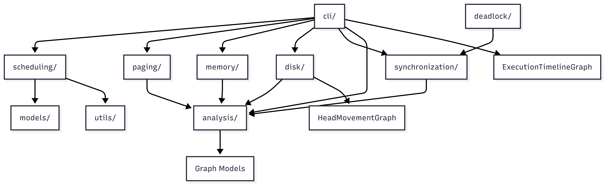
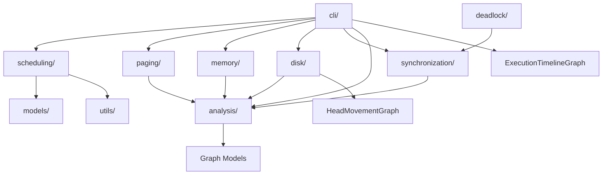

# Architecture

Below is a concise architecture view of the OS Simulator modules and their main relationships.

## Notes
- `cli/` is the entry point for interactive runs and scenarios.
- Core algorithm modules are isolated by topic (scheduling, paging, memory, disk, synchronization).
- `analysis/` provides cross‑module metrics and comparison/reporting utilities.
- Graph models are used for visualization and reasoning (head movement, execution timeline, algorithm comparison).

## Export to PNG (optional)
If you need a PNG, paste the Mermaid block into a Mermaid-compatible editor (e.g., Mermaid Live Editor) and export as PNG.
